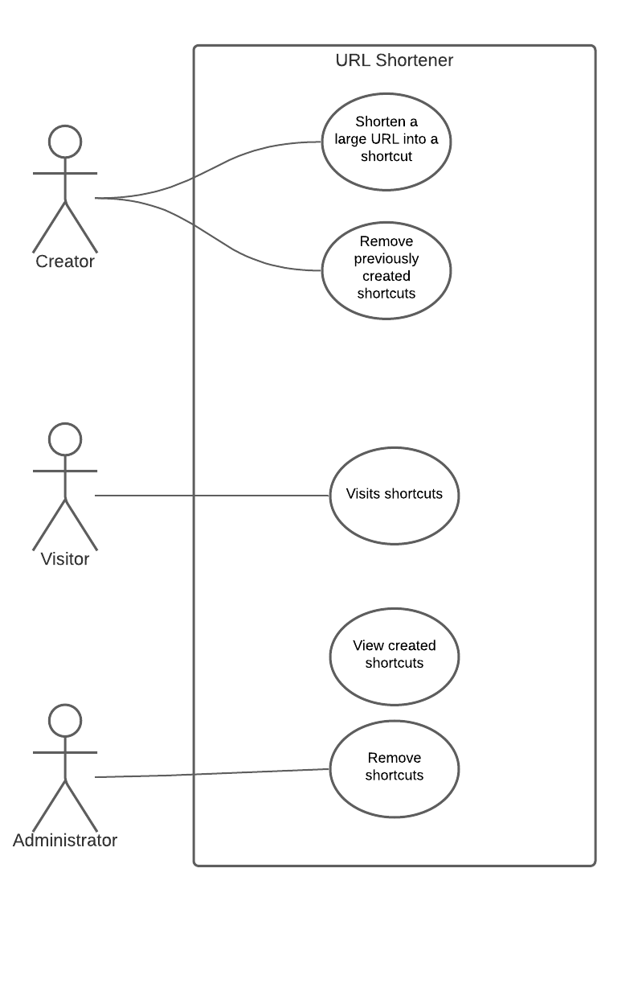
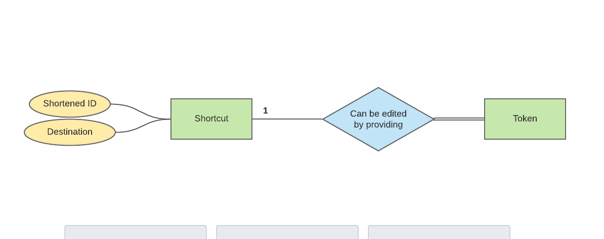
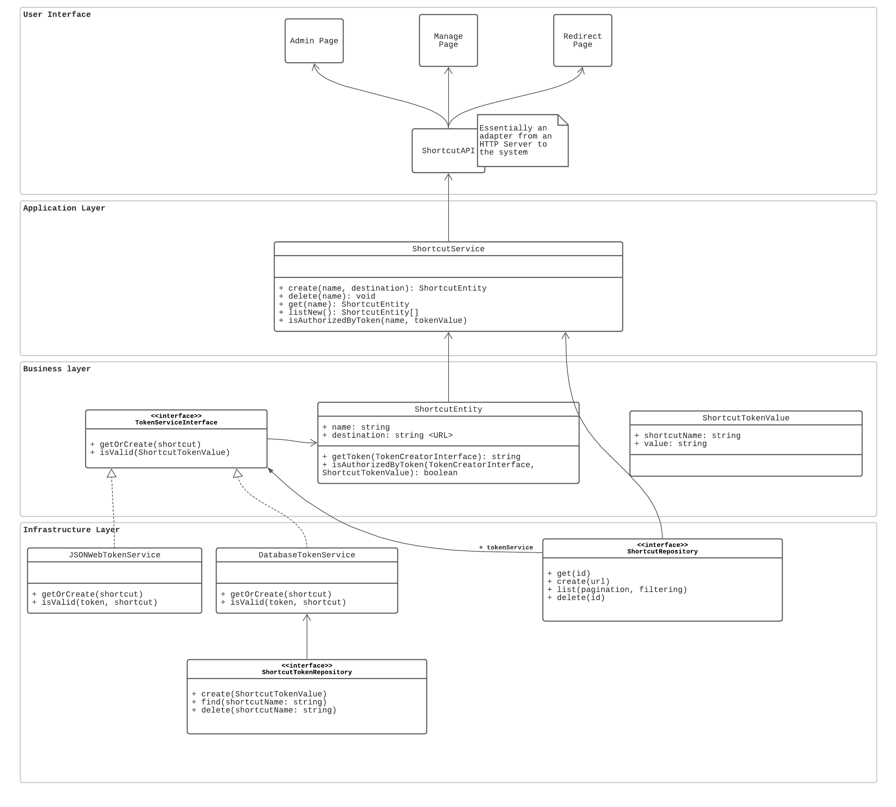

# Shortcut

Welcome! This repository is for demonstrative purposes and was created to improve my skill with designing software systems and architectures.

**Shortcut** is a simple url shortener. The design is based around Domain-Driven-Design, but take note that DDD ~might be~ is considered overkill for this size of an application.

## Design flow

I started out by designing a very simple use-case diagram. Through this diagram I wanted to make clear that there were multiple actors and a form of authz is required:

Up next was the simplest Entitiy-Relation-Diagram ever. (Note that 'edited' is incorrect and should be 'removed')

At last was the big challenge. Creating a clearly seperated layers of code. These layers are pretty much a direct rip of the DDD book by Eric Evans. But they work and that is cool.

Whilst researching software design techniques, I wrote some notes. Here is an excerpt of my definitions of the layers:

> ### User Interface
>
> Presents information to the user and allows interaction with the system.
>
> ### Application Layer
>
> The application layer is some sort of a manager which oversees processes, which are invoked by the User Interface Layer. The application layer is responsible for fetching the correct domain objects - through the infrastructure layer - and invoking methods on them.  
>  The application layer barely implements new logic and only invokes from the infrastructure layer and domain layer.
>
> ### Domain Layer
>
> Defines domain objects and their relevant methods. This means the domain objects contain business logic. Below is an excerpt from "DDD Quickly", which clearly implies that the domain objects are functional (i.e. have methods).
>
> > The application tier fetches the relevant domain objects from the infrastructure and invokes relevant methods on them...  
> > -- <cite>Domain Driven Design Quickly. P. 31</cite>
>
> ### Infrastructure Layer
>
> Provides libraries and supporting code. This code is not directly associated with business logic, but rather persistence, validation, communication, etc...

This translated into the following class diagram. This diagram has slightly adjusted throughout development, but this only resulted in renamed methods or adding a method.

## [License](./LICENSE)

WTFPL
